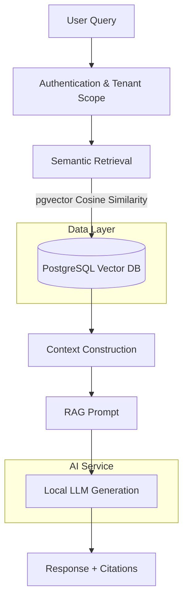

# KnowledgeOS Retrieval & RAG Engineering

## Problem
Enterprise knowledge is fragmented across multiple platforms (documentation, code repositories, meeting notes). Employees waste time searching for scattered information. KnowledgeOS solves this by providing a unified intelligent layer—using Retrieval-Augmented Generation (RAG)—allowing users to ask questions in natural language and receive accurate, grounded answers based strictly on organizational data.

## Architecture
The retrieval and generation pipeline is designed for strict data isolation and verifiable answers.

**Flow:**
1. **User Query** is authenticated, determining the allowed tenant scope (Organization ID).
2. **Semantic Retrieval** fetches top candidate chunks from the vector database.
3. **Context Construction** builds a strictly bounded prompt.
4. **Local Generation** produces the final answer and cites sources based solely on the provided context.

## Retrieval Baseline
Our production baseline focuses on simplicity, low latency, and robust quality without over-engineering:
- **Database:** PostgreSQL with `pgvector`.
- **Search Metric:** Cosine similarity.
- **Document Model:** Documents are split into overlapping character-based chunks.
- **Tenant Isolation:** Enforced at the database level; search queries filter strictly by `organization_id`.
- **Pool Size (K):** K=5.
- **Embeddings:** `sentence-transformers/all-MiniLM-L6-v2` (384 dimensions).

## Evaluation Strategy
To ensure production readiness, we built a deterministic evaluation pipeline:
- **Benchmark Corpus:** A controlled set of documents covering complex organizational rules (e.g., API Security, Tenant Isolation, RBAC).
- **Evaluation Dataset:** 20 live RAG cases categorized by difficulty (direct, paraphrased, lexical, multi_relevant, hard_negative, unanswerable).
- **Retrieval Metrics:** Recall@K, Precision@K, and Mean Reciprocal Rank (MRR).
- **RAG Answer Evaluation:** A deterministic evaluator scoring Correctness, Answer-Point Coverage, Groundedness (citations), Source Alignment, and Correct Abstention (refusal to hallucinate). The evaluator underwent rigorous hardening to eliminate false positives for contrastive statements and local negations.

## Experimental Method
We systematically evaluated potential improvements. *One variable at a time where practical.*

| Experiment | Independent Variable | Baseline | Key Result | Decision |
|---|---|---|---|---|
| **Lexical** | BM25 text match | Semantic only | High exact match but poor semantic understanding | KEEP EXPERIMENTAL |
| **Hybrid** | Semantic + Lexical | Semantic only | Can improve specific queries but requires tuning | KEEP EXPERIMENTAL |
| **RRF** | Reciprocal Rank Fusion | Single scores | Highly sensitive to parameter K, added latency | KEEP EXPERIMENTAL |
| **Reranking** | Query-aware Cross-Encoder | No reranker | Improved R@1/MRR, but mixed category effects and added 50-100ms latency | KEEP EXPERIMENTAL |
| **Candidate Pool** | K = 10, 15, 20 | K = 5 | Diminishing returns on quality, linear increase in latency | KEEP BASELINE |
| **Chunking** | 300/50, 600/75, 1000/300 | 1000/150 | Mixed results, no universally dominant configuration | KEEP BASELINE |
| **Embedding** | L12 model candidate | L6 model | Isolated testing framework prepared, full comparison deferred | DEFER |
| **Generation** | Evaluator improvements | Phase 8 setup | 90% pass rate, 0% unsupported claims. 2 missing-point failures remain | KEEP BASELINE |

## Strongest Results
### RAG End-to-End Benchmark (20 Cases)
Based on the final corrected Phase 9 evaluation runs (which produced identical quality metrics across repeated runs, demonstrating stability):
- **Overall Correctness (Pass Rate):** 90%
- **Answer-Point Coverage:** 71.7%
- **Groundedness:** 80%
- **Source Alignment:** 72%
- **Correct Abstention:** 100%
- **Unsupported Claims:** 0%

*Note: This evaluation represents performance on a specific 20-case internal dataset, providing a strong baseline indicator rather than universal proof of production readiness.*

## Failure Analysis
The 90% pass rate leaves two generation failures out of 20 cases:
- `rag_p02` (Paraphrased query on API protection)
- `rag_h01` (Hard negative query on RBAC vs. Authentication)

**Analysis:** Both failures were classified as missing expected answer points (scoring < 0.5 on required knowledge points), rather than hallucinations or forbidden claims. The evaluator was independently hardened to remove false positives (e.g., correctly distinguishing between "authentication decides role" and "authentication is separate from role"). Because these represent generation quality limitations rather than retrieval or safety failures, they are deferred for targeted prompt/model tuning.

## Experimental Decisions
We chose **NOT** to promote several features to production. Our guiding principle was to adopt changes only when evidence demonstrated a robust quality improvement justifying any added latency or maintenance cost.
- **Lexical / Hybrid / RRF:** Showed mixed metrics heavily dependent on tuning. Did not demonstrate universal superiority over the semantic baseline for our dataset.
- **Query-aware Reranking:** Improved certain metrics (MRR) but caused slight P@5 declines and exhibited category-specific behavior. The 50-100ms API overhead could not be justified for general use.
- **Larger Candidate Pools (K>5):** Provided insufficient evidence of quality improvement while linearly increasing retrieval latency.
- **Alternate Chunking:** Yielded mixed results without a dominant winner. Adopting a new chunking strategy requires a costly database migration and re-embedding process not justified by current evidence.

## Embedding Limitation
The transition from `all-MiniLM-L6-v2` (L6) to a heavier L12 model was prepared but is officially **deferred**.
- L12 is 384-dimensional and locally loadable.
- The evaluation infrastructure for an isolated corpus comparison exists.
- A full, isolated empirical L6-vs-L12 retrieval comparison was not completed.
- Therefore, L6 remains the production baseline. L12 is not claimed to be empirically inferior; its evaluation is simply deferred.

## Latency
Measured latency for a standard request (median):
- **Retrieval:** ~5-15 ms
- **Local Generation:** ~8,500-10,500 ms
- **Total Request:** ~9,000-13,600 ms

**Conclusion:** Local generation overwhelmingly dominates end-to-end latency (>99%). Future latency optimization should focus strictly on the generation path (e.g., streaming responses, faster/smaller models, caching) rather than micro-optimizing the already-fast retrieval layer.
